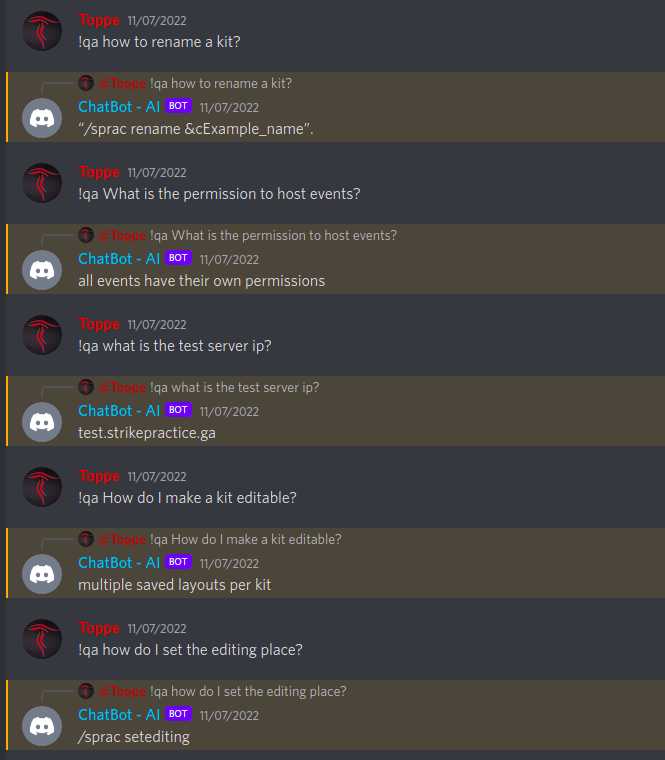

# SP QA BOT
StrikePractice (a Minecraft plugin) question-answer bot was an experimental Discord support bot.
The bot answered questions about StrikePractice and its features using modern language models without training (zero shot question 
answering).



The answer to "How do I make a kit editable?" is incorrect, other answers in this demo were correct (although, they were quite simple 
questions).\
The bot has not seen any of the questions before, it has only seen the documentation [input_docs.txt](input_docs.txt).

## How it works
1. The bot listens to messages Discord server
2. The bot scans the input_docs.txt file to find the best answer
   1. The file included had the StrikePractice plugin page "showcase" and documentation as text
   2. "deepset/roberta-base-squad2" model was used to find the best answer
3. The bot sends the best answer as a reply


## How to run
1. Create .env file with the following variables:
```
BOT_TOKEN=<your bot token>
```
2. Run with docker-compose
```
docker-compose up -d
```

This was just an experiment and the bot is no longer in use.
Unless you have a really beafy machine, answering may take a while and the bot may time out occasionally.